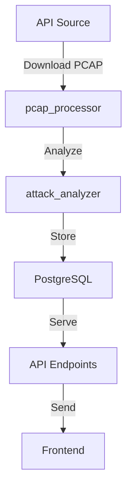

# Architecture Backend - Système d'Analyse PCAP

## 1. Vue d'Ensemble Simplifiée

```
backend/
├── app/
│   ├── __init__.py                 # Application Flask initialization
│   ├── api/                        # API endpoints
│   │   ├── __init__.py
│   │   └── attacks.py             # Endpoints pour les attaques
│   ├── core/                      # Logique métier
│   │   ├── pcap_processor.py     # Traitement PCAP
│   │   └── attack_analyzer.py    # Analyse MITRE ATT&CK
│   ├── models/                    # Modèles de données
│   │   ├── __init__.py
│   │   └── attack.py            # Modèle d'attaque
│   └── config.py               # Configuration globale
├── Dockerfile                 # Configuration Docker
└── requirements.txt          # Dépendances Python
```

## 2. Flux de Données Simplifié



## 3. Composants Essentiels

### 3.1 PCAP Processor

- Téléchargement automatique depuis http://93.127.203.48:5000/pcap/latest
- Conversion PCAP vers JSON
- Transmission vers l'analyseur

### 3.2 Attack Analyzer

- Classification MITRE ATT&CK
- Détection des indicateurs
- Stockage en base de données

### 3.3 API REST

```
GET /api/attacks/latest
- Retourne la dernière analyse
- Format: JSON

GET /api/attacks/categories/{category}
- Retourne les attaques par catégorie MITRE
- Categories: initial_access, execution, etc.
```

## 4. Modèle de Données

```sql
CREATE TABLE attacks (
    id SERIAL PRIMARY KEY,
    timestamp TIMESTAMP DEFAULT NOW(),
    category VARCHAR(50),
    technique_id VARCHAR(10),
    description TEXT,
    indicators JSONB
);
```

## 5. Configuration Docker

```yaml
version: "3.8"
services:
  db:
    image: postgres:latest
    environment:
      - POSTGRES_DB=attacks_db
      - POSTGRES_USER=admin
      - POSTGRES_PASSWORD=secret

  backend:
    build: ./backend
    ports:
      - "5000:5000"
    depends_on:
      - db
```
